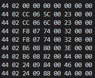

# Bowflex C6 Bluetooth Research
I could not find any resources on this so I took the time to try and figure out what the bowflex c6 bike outputs so that I may use the data in a new app. I have found my goal of discovering the cadence output of the bike, so I thought I would share the information.

Thanks to [Serial Bluetooth Terminal](https://play.google.com/store/apps/details?id=de.kai_morich.serial_bluetooth_terminal&hl=en_CA&gl=US) for helping me quickly read the data outputed from the bike.

## Service UUIDs
There are two different Service UUID's present on the bike. One of them outputs 9 bytes of data while the other outputs 11. The 9 bytes of data is the one needed for reading the cadence from the bike. I am not sure if the bluetooth UUIDs are unique to each device or each manufactured device, but my bluetooth UUIDs look like the following:

00001826-0000-1000-8000-00805F9B34FB Service UUID

00002AD2-0000-1000-8000-00805F9B34FB Read Characteristic

00002AD9-0000-1000-8000-00805F9B34FB Write Characteristic

The data for the correct one should look like below when running the bowflex python file.

## Cadence Location

The cadence is the fifth column from the left. This value is a range from 0-250 (when I went as fast as I could go the value never went above 250). When its normalized and scaled to 125 it matches the cadence present on the peloton app perfectly. 

## Suspected Wattage Location
The data for the wattage I suspect is located on the 3rd column from the left. Zwift reported me reaching 400 watts while the highest number tested on bfserial6 was 238. I suspect that this number might be halved, but its too hard to determine if there is any scaling on that number. It does fluctuate and follow when I increase the resistance, so I do believe this may be it.

Hopefully this helps you if you are wanting to develop apps fo the bowflex c6. Open an issue if you find anything wrong or could point me to official documentation.